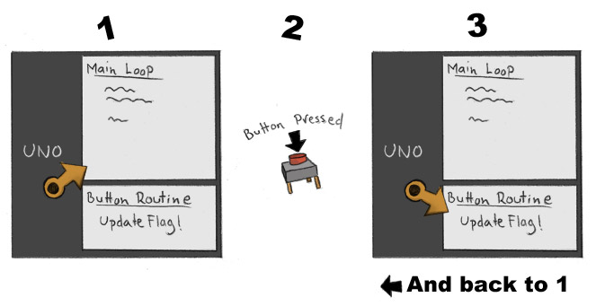

# Mode - Mood Buttons Overview

## Overview

This document explains how the system triggers a change in and stores what mode
and mood the helmet is in. The items I'm covering here...

* Change moods:
    * Passive (calm): Fins are lowered and eyes white.
    * Active (attack): Fins are spread and eyes red.
* Change modes: For specific heads.
    * Eagle: Jerky, fast, bird like movements.
    * Jackal: Smooth, more stealthy movements.

## How To Change Things

Note that is this document covers how the buttons work (software wise), not the
outward effect of said changes. There are however documents that do cover those
items so check them out as well. But to handle things behind the scenes, there
are two items to discuss, system flags and hardware interrupts.

### System Flags

As the main loop, well... loops, it checks which mood and mode the system is
currently in and acts accordingly. Nothing unique here but we need to keep track
of these two states so we'll need a couple variables. For the moment there are
only two options for each but to allow for "possible" additions I'll use
integers as follows...

* currentMode
    * 0: Smooth Movements
    * 1: Jerky Movements
* currentMood
    * 0: Calm
    * 1: Angry

#### Note

**You don't need to use these specific names but make sure yours are equally
self explanatory! For instance, if you used a Boolean for mood, you might change
it to "isAngry" where true and false have obvious meaning.**

But when the loop comes to some logic where it needs to know which state the
system is in, it checks these flags which lead it down a specific path. Keep in
mind that these will be global variables, are accessed by multiple functions.
Meaning, take care not to modify them unless absolutely appropriate. I'm doing
so in only one place which is covered next.

### Hardware Interrupts

There are two ways to tackle buttons, you can either poll them or use an
interrupt. There are many explanations of this online so only a quick recap.

#### Polling

This mean your software has to purposely check the state of each button. Meaning
you have to push the button exactly when the software is running the code
checking whether it's pressed. Which is doable but the press can be missed and
it means your taking time away from other things like animations.

#### Interrupts

This is a feature on some microcontrollers and implemented in hardware, not your
code. But the chip itself will monitor the button and whenever it is pressed
performs a specific function called an **Interrupt Service Routine**. This frees
your loop to do other things and the press is less likely to be missed.

But not all pins have interrupts available, you'll need to check on what is
available on the chip you're using. On the Arduino Uno only two of the pins
(pin 2 and 3) actually allow this but you can easily mod the code if you are
using one with more.

### The Buttons In Question

So we have three buttons and not all of them can use interrupts. Button 1 which
will re-center the head/mask will be the odd man out and use polling. I won't
cover that here but is covered by the [Movement Overview](MovementOverview.md).
Notice on the wiring diagram, I have buttons 2 and 3 hooked up to pins
(coincidentally 2 and 3) which allow interrupts on the Uno.

These buttons have a single purpose, to change the flags stating which mode and
mood we're in. Or as a very simplified three step process...

Using interrupts means the main loop can focus on updates and animation and not
checking whether these buttons are being pressed. If a button is pressed, it
will jump to the routine which handles that event and when finished, back to the
main loop.

A thing to keep in mind is that interrupt routines should be short. Just a quick
jump, do what you need to and back to the main loop asap. You can see how short
these really are in the code itself though.
