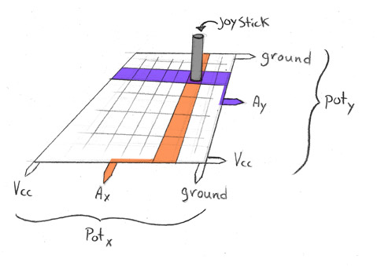

# Head Movement Overview

## Overview

This document explains how the head movements work and why we went one route vs
another. It's essentially just this portion of our diagram...

* Move Laterally: Turning the head left and right.
    * Turn head to the left.
    * Turn head to the right.
* Pivot:
    * Tilt head to the left.
    * Tilt head to the right.
* Re-center the head.
* Change modes: For specific heads.
    * Eagle: Jerky, fast, bird like movements.
    * Jackal: Smooth, more stealthy movements.

## How The Head Is Rigged

The first thing you should have is a clear picture of how the head is actually
set up and masks fit in. Again, check out Honus' [Animatronic Stargate Helmet](http://www.instructables.com/id/Animatronic-Stargate-helmet/)
Instructable if you want the fine detail. I am going to simplify things and
focus mainly on the servo's themselves. But the rough setup looks like this...

Or this version gives a bit more perspective in which there are two servos
(L and R) to control lateral movements and another up front (C) to handle tilt.
These are tucked slightly into the mask which mounts to servo C. Also notice
that L and R are setup in reverse. Roughly 90 degrees on either should be center
but an increase/decrease will have opposite effects.

Servo C is attached to a bracket which pivots left and right by way of rods
connected to servos L and R as depicted below...

To shift the head right or left, the angle on both servos are increased or
decreased by the same amount, essentially moving in lockstep but opposite
direction wise. If the servos get out of synch, where both go the same
direction, this would cause the head to look up or down. Similar to playing a
flight simulator, pushing forward to go down or pulling back to go up.

### Note

**As mentioned previously, there are reasons I am not having our mask look up or
down. If you chose to however, it wouldn't be that difficult to implement but
might require an extra part or two and I won't be covering that going forward.**

## How The Joystick works

There are two things to discuss here, one is how the joystick is constructed and
the other is how the Arduino (or microcontroller of choice) is actually going to
make use of it.

### The Basic Idea

Instead of trying to draw the exact parts used, think of the joystick as two
potentiometers arranged flat and orthogonally as illustrated here...

This forms a grid of sorts, the boundaries or range of which are set by the
outer pins connected to power and ground. The resolution is determined by what
actually reads the values, most likely an analog to digital converter built
into the microcontroller.

The variable (Ax or Ay) pins of both potentiometers are moved simultaneously via
the joystick and result in or point to some (X, Y) coordinate (voltages) between
the power and ground used by each pot respectively.

#### Note

**You can flip ground and Vcc, it's nothing to worry about, it just means you'll
have reverse logic and need to account for that in code as well. Hook some power
and a multimeter to the joystick, tinker and decide which order makes more sense
to you.**

### How It's Used

The key here is that the value of both variable pins which will be somewhere
between Vcc and ground (usually 0 to (3.3 or 5) volts) can be read to determine
exactly what position the joystick is in. This is why I have them wired to pins
A0 and A1, though you can choose any free analog pin.

Those pins have **10 bit Analog to Digital Converters** attached which
translates the voltage applied to a 10 bit digital equivalent. Or in other
words, it takes the voltage applied to that pin (0 to Vcc) and maps it to a 10
bit representation (0 to 1023). If you are using an Arduino, I suggest reading
the page for
[AnalogRead()](https://www.arduino.cc/reference/en/language/functions/analog-io/analogread/).
I am sticking with the defaults but if you want to tweak thing, that'll point
you in the right direction.

Once you have the value though, how do you make use of it? The first thing I do
is break the range of potential values on each pin into zones like so...

You could have more or less zones than I do, evenly spaced though, this means
each zone is 124 values wide. But zones don't have to be uniform, you can define
whatever ranges work for you. Just keep in mind that center is not 0, center is
roughly 511 (2^5 - 1)) or the cutoff between zones 5 and 6. There are many ways
to do this but the final process is essentially just...

* Read the value on each potentiometer.
* Process the value via the scheme you're using.
* Use the processed value to determine what changes (if any) should happen.

The first two are handled above, the third depends on the current mode which
I'll explain below. I'll be using the joystick as follows...

* Potentiometer X: Handles lateral movements (turning the head left and right).
* Potentiometer Y: Since our head doesn't move horizontally, I'm using this to
control head tilt.
* Button 1: This is the button built into the joystick itself and if pressed
will re-center the head.

## How The Head Moves

The head behaves differently in different modes. Jaffa with the Jackal mask have
smooth stealthy motions whereas those with Eagle masks have jerky bird like
motions.

In all cases, if the joystick is centered then no motion is wanted. But there
may be a little vibration or wobble if bumped or perhaps by holding your thumb
on the stick. We wouldn't want the head reacting to these tiny unwanted
fluctuations. But we can ignore them by making zones 5 and 6 a margin of safety
or inactive area where no lateral movement or tilt can occur. Everything else
is as follows...

### Lateral Movements

#### Smooth Motion

As the joystick moves past the inactive area, the head should start to turn.
Beginning with zones 4 and 7 the head should start to turn left or right
respectively. This should be slow however, speeding up as the joystick is pushed
further from center, maxing out in zones 1 and 10. The motion will be smooth but
speed controlled by the user.

#### Jerky Motion

In this mode we don't want smooth transitions, we want the head to snap from one
position to another. This is more of a creepy, unnatural motion... at least for
humanoid characters.

To avoid accidentally triggering a head move I'm going to add zones 4 and 7 to
the inactive area. Pushing the joystick into the outer zones however will make
the head turn as far in that direction as possible. There isn't much finesse
here!

### Head Tilt

#### Smooth Motion

Much like with lateral movements, as the joystick moves past the inactive area
it should start to tilt to either the left or right.

There is a problem using the joystick though. If while making lateral movements
you don't move the joystick perfectly from side to side with no up or down sway,
it can also tilt unintentionally. Since this is the less common motion I'm going
to add zones 4 and 7 to the inactive area. Beyond that, the head will start to
tilt, doing so faster as the joystick is pushed further from center.

#### Jerky Motion

As expected this changes in the same way as jerky lateral motions. I want to be
extra careful however to not trigger the tilt unless really requested. As such
I'm going to add zones 3 and 8 to the inactive area. Outside of that, the head
will tilt right or left with a quick, creepy motion.

### Re-Centering The Head

This works reverse of the situations above, in that we only want to trigger
re-centering the head if no other motion is requested. It wouldn't make sense to
suddenly do so (by accidentally pushing down on the joystick) while actually
trying to make some other movement.

So, while a reset or re-centering of the mask will instantly return all servo's
to a default or centered position. The only rule here is that it won't do
anything unless the joystick is in the inactive area (zones 5 and 6) on both
potentiometers.

#### Note

**This setup, if nothing else is a good place to start. You might see my final
code has more/fewer zones, bigger/smaller inactive areas, etc. It's all about
finding what works for you and with parts you're using. Some are more or less
precise, easier to control, etc. so tweak things until your comfortable with
what you have.**
