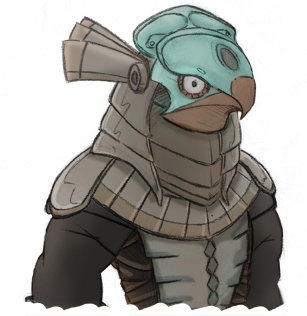

# Stargate-JaffaHelmet

This is a cosplay project my friends and I have been working on, a replica Jaffa
uniform complete with animatronic helmet and staff weapon. Jaffa being from the
1994 movie "Stargate", or if you're more familiar, the TV series "SG1" that
came about some time later. But something that looks kinda like this...

Or if you're not a fan of silly doodles and questionable coloring skills, this
is a reference image we've been working from...

### Note

If you don't like my doodles, you're really not gonna like the rest of this
write-up because I do lots of them... you have been warned!

### Note

Rather than starting from scratch, we based things on an Instructables titled
[Animatronic Stargate Helmet](http://www.instructables.com/id/Animatronic-Stargate-helmet/)
by the user Honus. We've made many tweaks though; for instance opting to build
it out of EVA Foam instead of paper craft. Mechanically however, everything is
identical or works with Honus's tutorial. So for additional construction
questions, please check out that instructable.

### Note

I'll be detailing our modifications here. I'll try to keep it fairly generic as
the exact parts or form factors are less important than functionality. I
encourage people to take apart and reuse old things as much as possible as I
myself am learning how things are built and that's a great way to figure stuff
out!

## What We Change

If you start with Honus's arduino sketch, changes happen at regular intervals.
The program loop simply tells each servo to take a new position and then delays
for set time intervals. Not bad if you're in a pinch or for testing purposes but
we'd like our version to be interactive.

For instance, we want to be able to follow a camera or onlooker and change moods
on command. The following is an illustration and list of actions to be added.

* Move Laterally: Turning the head left and right.
    * Turn head to the left.
    * Turn head to the right.
* Pivot:
    * Tilt head to the left.
    * Tild head to the right.
* Re-center the head.
* Change moods:
    * Passive (calm): Fins are lowered and eyes white.
    * Active (attack): Fins are spread and eyes red.
* Change modes: For specific heads.
    * Eagle: Jerky, fast, bird like movements.
    * Jackal: Smooth, more stealthy movements.

## Breakdown

Below is a list of each change, on it's own, both hardware and software. I try
to break it down so you can look at or implement things in pieces but certain
items do overlap...

* [Building the Remote](RemoteControl.md)
* [Head Movement - Overview - Coming Soon]()
* [Head Movement - Code - Coming Soon]()
* [Mood Indication - Overview - Coming Soon]()
* [Mood Indication - Code - Coming Soon]()
* [Full Helmet Arduino Sketch - Coming Soon]()
