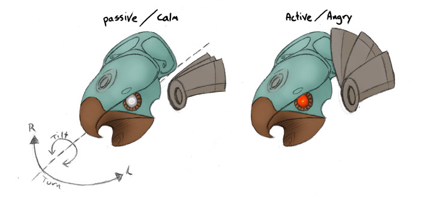

# Stargate-JaffaHelmet

## Overview

This is a cosplay project my friends and I have been working on, a replica Jaffa
outfit, complete with animatronic helmet and staff weapon. Jaffa being from the
1994 movie "Stargate", or if more familiar, the TV series "SG1" that came about
some time later... Or more specific, one of these guys,

If you'd rather something more realistic however, this is a reference image
we've been working from...

I try not to rely or dwell on the source material too much though as screen
accuracy isn't the main focus (given skills, budget, time, etc.) or even
possible. So if you're following along with this, my goal is to keep things
somewhat generic. Do the best with what you have available and make notes on
what to change/do better next time.

### Note

**Rather than starting from scratch, we based things on an Instructable titled
[Animatronic Stargate Helmet](http://www.instructables.com/id/Animatronic-Stargate-helmet/)
by the user Honus. We've made several tweaks, for instance opting to build
it out of EVA Foam instead of paper craft. Mechanically however, everything is
identical or works with Honus' tutorial. So for specific construction details,
please check that out.**

## The Goal Here

If you start with Honus' Arduino sketch, movements happen at regular intervals.
The program loops about, telling each servo to reposition and then delays for a
set interval. Not bad in a pinch or for testing but we'd like some
interactivity.

For instance, we want to be able to follow a camera, respond to the crowd or
change moods on command. Here is a basic illustration and list of things we want
to control.

* Move Laterally:
    * Turn head to the left.
    * Turn head to the right.
* Pivot:
    * Tilt head to the left.
    * Tilt head to the right.
* Reset/re-center the head.
* Change moods:
    * Passive (calm): Fins are lowered and eyes white.
    * Active (attack): Fins are spread and eyes red.
* Change modes: For specific masks/heads.
    * Eagle head: Jerky, fast, bird like movements.
    * Jackal head: Smooth, more stealthy movements.

## Breakdown

The items that need work fall into two general categories, whether they apply to
head movements or indicate mood. We also need to start by deciding on and
building some way to control everything. There is a little overlap but I tried
to break it up as best I could via the following documents...

* [Building the Remote](RemoteControl.md)
* [Mode/Mood Buttons - Overview](ModeMoodButtonOverview.md)
* [Mode/Mood Button - Code - Coming Soon]()
* [Head Movement - Overview](MovementOverview.md)
* [Head Movement - Code - Coming Soon]()
* [Mood Indication - Overview - Coming Soon]()
* [Mood Indication - Code - Coming Soon]()
* [Full Helmet Arduino Sketch - Coming Soon]()
