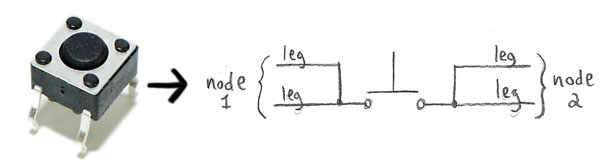

# Remote Control

## Overview

As mentioned, we want to switch from a delay based animation cycle to something
that requires outside stimulus...

Before I continue. this really isn't a "how to" construct a remote. As in, I
won't attempt teaching anyone how to soldering, cut PVC, work with EVA foam and
the likes. But this should be enough to know what needs to happen and possibly
construct one from whatever materials you're comfortable working with or happen
to have sitting around.

As usual, I say use your imagination and worst case e-Mail with any questions.
So to reiterate, let's look at the functionality we want to tinker with...

* Move Laterally: Turning the head left and right.
    * Turn head to the left.
    * Turn head to the right.
* Pivot:
    * Tilt head to the left.
    * Tild head to the right.
* Re-center the head.
* Change moods:
    * Passive (standby): Fins are lowered and eyes white.
    * Active (attack): Fins are spread and eyes red.
* Change modes: For specific heads.
    * Eagle: Jerky, fast, bird like movements.
    * Jackal: Smooth, more stealthy movements.

### Note

You'll notice I don't list horizontal movements, up or down. This is partially
because they don't really do that in the source material. It is also because the
ball joint we're using to hold the head is **super** stiff and our servo's have
trouble adjusting it in said directions.

## Other Considerations

We know how everything actually works but want some sense of illusion (for the
crowd) that the head is somewhat autonomous or alive and not just some fancy
puppet. It's also going to be controlled by the wearer, not from some out of
sight location so...

* It needs to fit/blend with the costume, too obvious and the effect is lost.
* It should be easy to pick up and put away, without fumbling about.
* Preferably usable both left and right handed.

## Parts

### Joystick

You could do everything via buttons, for motion though, a joystick seems more
intuitive. We opted to use a **3D analog thumb joystick** to turn and tilt
the head. This is the type you find in game controllers which offer a lot of
functionality in a fairly small package. That also means you could either pilfer
(repurpose) one or order it online.

They are essentially just two potentiometers (pots) and a normally open,
momentary button all packaged into a convenient form factor. They come on
breakout boards, with or without caps, etc. and break down like so...

### Buttons

For the other functions however, a normally open, momentary button is all we
need. Nothing fancy here, you could likely find a few in some old broken device
if you hang onto that kind of stuff. If not, there is always Amazon and look
something like this...

These happen to have four legs to which you can solder wires. Internally however
the two legs on each side are connected, forming a single node. If you're not
sure which two legs form each node, using a multimeter to check for continuity
is probably the easiest method.

### Optional Hardware Debouncing

Short of materials for your final build, necessities like wire and solder, the
items above are all you really need. I am personally going to use a hardware
debounce via an **Inverting Schmitt Trigger** (part number SN74HC14N) and RC
circuit which requires a few extra parts. If you have no idea what I'm talking
about, there is a great explanation on [All About Circuits](https://www.allaboutcircuits.com/technical-articles/switch-bounce-how-to-deal-with-it).

I prefer hardware debouncing but if you'd rather do so in software, this is
a decent tutorial via [Arduino](https://www.arduino.cc/en/Tutorial/Debounce).
There are many other ways to do this however so I suggest looking up a few and
picking your favorite. I won't provide code for this method but have wiring
diagrams for both below.

### Shopping List

* Required:
    * 3D Analog Joystick (x1)
    * Normally Open Momentary Button (x2)
    * 10 K-Ohm (or similar value) resistor (x3)
* Optional:
    * Inverting Schmitt Trigger SN74HC14N (x1)
    * 100 K-Ohm resistor (x3)
    * 10 K-Ohm resistor (x3)
    * 0.1 u-Farad capacitor (x3)

### Note

As mentioned above, you don't actually need the joystick, I just think they are
cool and make controlling movements easier. As the diagram pointed out, you
could use two potentiometers and an extra button for a similar effect.

## Circuit Diagrams

### Debounce Circuit

The hardware debounce is an RC circuit where the capacitor is initially charged.
This means the input (Xa) to the Inverted Schmitt Trigger is positive but output
(Xb) will be inverted (negative). The situation is flipped when the button is
pressed and capacitor discharges.

The Inverting Schmitt Trigger is an integrated circuit (IC) that has multiple
triggers built in. Each trigger with its own input (Xa) and output (Xb) so you
only need one IC to handle multiple buttons. So even though they are built into
the same chip, think of each trigger independently, 1a and 1b, 2a and 2b, etc.

Each input using this setup is identical. So while you physically need the
respective parts and power, to avoid clutter I'll replace it in drawings with
the following black box setup...

Just remember you need to physically build the circuit for each button, choosing
an unused trigger for each (which trigger doesn't really matter). Nodes A and B
are still where said button connects across and Node D (of the selected trigger)
goes to whichever digital input is being used to read the state.

### Wiring **Without** Hardware Debounce

The circuit without all the hardware debouncing is fairly straight forward but
remember your code is going to be more complicated. Again, I'm not going to
cover that but there are many explanations and options available online.

### Wiring **With** Hardware Debounce

The one with hardware debouncing is mostly the same only now each button feeds
directly into a debounce circuit at nodes A and B. It doesn't matter which side
of the button goes to which. Node D connects to the input pin you're using for
that connection.

## Final Result

Well almost final result. I figure it's more useful to show it before I do all
the faux finishes and whatnot. This is actually version 5, the first four ended
up being too bulky and/or awkward to use. So learn from your mistakes and
refine, refine, refine!

This first image shows the remote broken into the two main parts, the joystick
"cap" and handle that contains buttons 2 and 3.

Here is the remote put together. The excess PVC tubing slides into the cap
section which holds well due to being snug by design. This also allows the user
to rotate it to fit their hand better.

As a final check, the unit is relatively tiny, fitting in my palm (I don't have
the biggest hands to begin with) which won't draw too much attention. There are
specific groves that make it easy to pick up and position without fumbling
about. It also works nicely in either hand, just rotate the cap to a comfortable
position.

Of course, the wires still need to be terminated with connectors. I also need to
design a cap for the end and give it a faux finish that matches the costume but
that can wait. 
